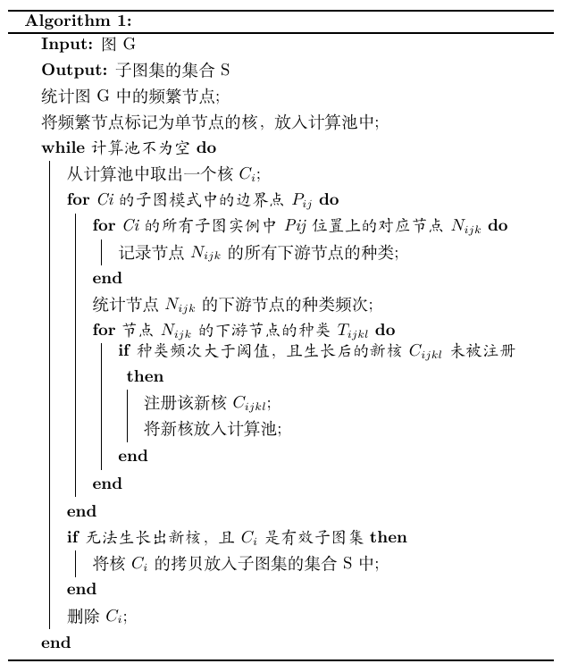

# 算法简述

## 名词解释
- **子图集(Subgraph)**:子图的集合，该集合中任意两个子图项都是同构的。
- **子图模式(Subgraph Pattern)**:子图集中的子图的节点类型的集合，描述了子图集中所有子图所一致的节点类型。
- **有效的子图集(Committed Subgraph)**:满足一定要求（比如子图数目限制，子图节点数目限制）的子图集，也是本项目期望得到的结果。
- **子图核集(Subgraph Core)(以下简称“核")**:与子图集类似，不同的是该集合中的子图可能是可生长的。一旦确认子图核集的子图模式不可生长(即生长后不是有效的子图集)，子图核集就可被确认为子图集。每个子图核集都拥有独特的ID，由本子图核集的最小ID节点所在的子图的所有节点编号降序排列的字符串的Hash值唯一确定。
- **下游节点(Downstream Node)**:某一算子节点的输出边连接到的节点。
- **候选生成/生长(Grow)**:由一个核从某一生长节点上扩展一个或多个新节点，且所有新节点都是生长节点的下游节点。大多数情况下，一个核能z生长为多个核(核分裂)，其中支持度下降，子图模式增多。
- **生长周期(Epoch)**:每一生长周期，所有核都会生长一次。
- **核的注册(Register)**：记录所有核的ID，以避免重复计算。

## 伪代码
本项目所使用的算法，基于Apriori思想进行改进，使用“自下而上”的方法，首先生成单节点的核，核进行多次生长，每次生长后移除原来的核，当所有核都生长为子图集后，算法终止。

下面给出了算法伪代码：

## 编码视角的描述

### 子图核集

与大多数编码实现不同，本项目中的子图核集没有保存边的关系，而是按序保存了节点的关系，即子图模式。在整个项目中，核（子图核集）为核心数据结构，所有调度和控制都围绕着核展开。

比如`Node1(biaAdd)->Node2(Conv2D)`与`Node3(biaAdd)->Node4(Conv2D)`同构，则子图核集保存的是`{pattern:['biaAdd', 'Conv2D']，nodes:[(1,2), (3,4)]}`，ID为`hash("1-2")`.

为了保证核模式在遍历时只遍历边界点，并减少功能耦合，核可以作为迭代器，只有边界点会被遍历取得。

### 执行器

算法执行采用Map-Reduce机制，执行器中的计算池存储着前一生长周期被提出的核，通过线程池调度的方式进行生长计算，从而获得下一生长周期的新计算池。每个核的生命周期都为一个生长周期，在生长周期结束后可能被销毁或拷贝提交。同时使用了子图核集的注册机制以避免冗余计算，每一子图核集(除单节点的外)在被提出时都需要通过执行器进行注册(注册需要是线程安全的)，冗余的核将不被加入计算池。

### 执行步骤

（步骤编号表征了各步骤间的层次关系）

|步骤|操作|解释|代码实现|
|--|--|--|--|
|1|统计频繁节点，生成单节点的核|任意有效子图集的任意子图的任意节点都可以组成单节点的核|`SMSGraph(...).node_count()`|
|2|(*循环*)执行生长周期，直至无核|让每一个核充分生长（分裂）|`Executor(...).run()`|
|2.1|(*循环*)对所有核，执行一个生长周期|让当前的每一个核进行一次生长（分裂）|`Executor(...).next_epoch()`|
|2.1.1|使一个核进行一次生长（分裂）||`core_grow(...)`|
|2.1.1.1|(*循环*)遍历核的模式的所有边界点(position)，得到从此位点能生长出的所有核的集合||`core_grow(...)`|
|2.1.1.1.1|对某一边界点(position)的所有子图实例，进行统计，得到此位点的所有下游节点的可能类型||`core_grow._check_stream_on_one_position(...)`|
|2.1.1.1.2|对此位点的所有下游节点的可能类型进行计数，若满足条件，则将其标记为新核|新核是旧核的拷贝，并添加了新位点的信息，同时更新了最小ID节点等相关信息|`core_grow._check_stream_on_one_position(...)`|
|2.1.1.1.3|注册新核|用以避免核的重复生长计算|`Executor(...).register_core(...)`|
|2.1.2|若一个核不能继续生长或分裂，检查其是否有效，若有效，则提交为有效的子图集||`Executor(...).commit_core(...)`|
|2.2|更新核|每一个生长周期核都会更新一次，上一生长周期的核会被删除或提交|`Executor(...).next_epoch()`|
|2.3|检查已提交的核|将冗余的子图移除，主要为了解决高阶的子图同构爆炸|`Executor(...).check_subgraph()`|
