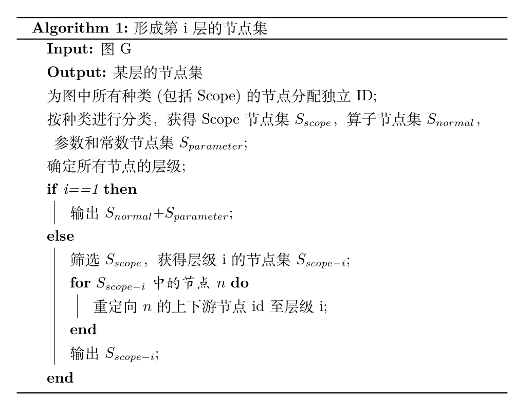

# 算法简述

## 1. 名词解释
- **子图集(Subgraph)**:子图的集合，该集合中任意两个子图项都是同构的。
- **子图模式(Subgraph Pattern)**:子图集中的子图的节点类型的集合，描述了子图集中所有子图所一致的节点类型。
- **有效的子图集(Committed Subgraph)**:满足一定要求（比如子图数目限制，子图节点数目限制）的子图集，也是本项目期望得到的结果。
- **子图核集(Subgraph Core)(以下简称“核")**:与子图集类似，不同的是该集合中的子图可能是可生长的。一旦确认子图核集的子图模式不可生长(即生长后不是有效的子图集)，子图核集就可被确认为子图集。每个子图核集都拥有独特的ID，由本子图核集的最小ID节点所在的子图的所有节点编号降序排列的字符串的Hash值唯一确定。
- **下游节点(Downstream Node)**:某一算子节点的输出边连接到的节点。
- **候选生成/生长(Grow)**:由一个核从某一生长节点上扩展一个或多个新节点，且所有新节点都是生长节点的下游节点。一般情况下，一个核能生长为多个核(核分裂)，其中支持度下降，子图模式增多。
- **生长周期(Epoch)**:每一生长周期，所有核都会生长一次。
- **核的注册(Register)**：记录所有核的ID，以避免重复计算。
- **节点的层级(Level)**: 节点在节点树中的层级，算子节点都为1,scope节点的层级是其所有成员节点的层级最大值加一。

## 2. 算法与实现

本项目分为两个模块，分别用于形成节点集和在特定节点集中进行子图挖掘。

### 2.1. 数据结构

> 在v0.1.2版本后，引入了scope， parameter, const节点，并使用了全局化节点，因此所有节点间不仅具有计算“图”的联系，而且具有层级关系，也就具有了“树”的联系。

**节点**由`SNode`类所定义的数据结构存储，每个节点既保存了上下游节点（保存计算图中的联系），也保存了自己所属的命名空间（保存节点树中的联系）。`Scope`类继承自`SNode`，在其基础上，`Scope`还额外存储了自己的组成节点。为了避免循环引用，`SNode`和`Scope`在存储其它节点时，只存储了ID，具体节点信息需要到`SMSGraph`中去查询。同时，它们的设计采用了鸭子类型的风格，在子图挖掘阶段，两种类型的实例是等效的。

**计算图**由`SMSGraph`类所定义的数据结构存储，它保存了一个计算图中的全部信息，并提供了丰富的接口以接受各种查询。它的另一个主要功能是解析`MSGraph`对象，将其数据按本项目设计的方式整理和清洗。

**子图的层次结构**没有专门的类定义存储，而是使用节点存储的信息结合计算图的查询接口完成查询。在需要递归建树或查询时，使用猴子补丁的方式，将函数临时附加到节点类上，以完成需要的功能。

**子图**相关信息由`Subgraph`类所定义的数据结构存储（生长时为`SubgraphCore`），与大多数编码实现不同，本项目中的图没有保存边的关系，而是按序保存了节点的关系，即子图模式。在子图挖掘中，核（子图核集）为核心数据结构，所有调度和控制都围绕着核展开。比如`Node1(biaAdd)->Node2(Conv2D)`与`Node3(biaAdd)->Node4(Conv2D)`同构，则子图核集保存的是`{pattern:['biaAdd', 'Conv2D']，nodes:[(1,2), (3,4)]}`，ID为`hash("1-2")`.为了保证核模式在遍历时只遍历边界点，并减少功能耦合，核可以作为迭代器，只有边界点会被遍历取得。

### 2.2. 节点集形成算法

节点集形成算法就是从所有节点中筛选出某个特定层级的节点，形成待挖掘的节点集。主要难度在于，各个节点存储的上下游节点都是level-1的节点，为了在筛选中保持图的结构，需要将上下游节点重定向至特定层级的节点，需要递归的查询各个节点的符合要求的祖先。

下面给出了算法伪代码：

### 2.3. 子图挖掘算法

本项目所使用的子图挖掘算法，基于Apriori思想进行改进，使用“自下而上”的方法，首先生成单节点的核，核进行多次生长，每次生长后移除原来的核，当所有核都生长为子图集后，算法终止。

下面给出了算法伪代码：

### 2.4. 并行调度与执行

为了充分使用硬件并加快速度，子图挖掘部分算法执行采用Map-Reduce机制，执行器中的计算池存储着前一生长周期被提出的核，通过线程池调度的方式进行生长计算，从而获得下一生长周期的新计算池。每个核的生命周期都为一个生长周期，在生长周期结束后可能被销毁或拷贝提交。同时使用了子图核集的注册机制以避免冗余计算，每一子图核集(除单节点的外)在被提出时都需要通过执行器进行注册(注册需要是线程安全的)，冗余的核将不被加入计算池。

